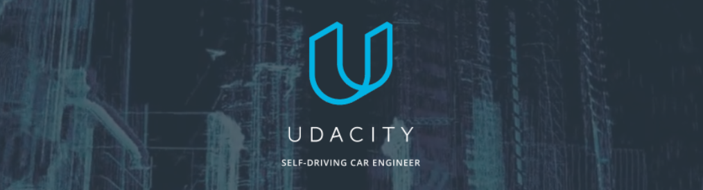

This repository contains the results of Team East Coast's capstone project for the [Udacity Self-Driving Car Engineer Nanodegree Program](https://www.udacity.com/drive). The project utilizes Ubuntu Linux 14.04 with [Robot Operating System (ROS)](https://www.ros.org) Indigo and/or Ubuntu Linux 16.04 with ROS Kinetic, the [Udacity System Integration Simulator](https://github.com/udacity/CarND-Capstone/releases), and code written in C++ and Python to provide a System Integration solution to the self-driving car problem. The code developed will be tested on Udacity's real-world test vehicle (a Lincoln MKZ that the company has named "Carla") during the month of October. More information on the results of those tests will be made available in the **Updates** section of this README. 

#### For now, check out our latest Udacity simulator results on YouTube:

[](https://www.youtube.com/watch?v=4lzDBvFPQMM)

### Team Members
- Anthony Sarkis (anthonysarkis@gmail.com)
- Cahya Ong (cahya.ong@gmail.com)
- Neil Hiddink (nhiddink2@gmail.com)
- Xianan Huang (xnhuang@umich.edu)
- Yasen Hu (yasenhu789@gmail.com)

### Updates

_COMING SOON - STAY TUNED!_

---

### Installation 

* Be sure that your workstation is running Ubuntu 16.04 Xenial Xerus or Ubuntu 14.04 Trusty Tahir. [Ubuntu downloads can be found here](https://www.ubuntu.com/download/desktop). 
* If using a Virtual Machine to install Ubuntu, use the following configuration as minimum:
  * 2 CPU
  * 2 GB system memory
  * 25 GB of free hard drive space
  
  The Udacity provided virtual machine has ROS and Dataspeed DBW already installed, so you can skip the next two steps if you are using this.

* Follow these instructions to install ROS
  * [ROS Kinetic](http://wiki.ros.org/kinetic/Installation/Ubuntu) if you have Ubuntu 16.04.
  * [ROS Indigo](http://wiki.ros.org/indigo/Installation/Ubuntu) if you have Ubuntu 14.04.
* [Dataspeed DBW](https://bitbucket.org/DataspeedInc/dbw_mkz_ros)
  * Use this option to install the SDK on a workstation that already has ROS installed: [One Line SDK Install (binary)](https://bitbucket.org/DataspeedInc/dbw_mkz_ros/src/81e63fcc335d7b64139d7482017d6a97b405e250/ROS_SETUP.md?fileviewer=file-view-default)
* Download the [Udacity Simulator](https://github.com/udacity/CarND-Capstone/releases/tag/v1.2).

### Usage

1. Clone the project repository
```bash
git clone https://github.com/udacity/CarND-Capstone.git
```

2. Install python dependencies
```bash
cd CarND-Capstone
pip install -r requirements.txt
```
3. Make and run styx
```bash
cd ros
catkin_make
source devel/setup.sh
roslaunch launch/styx.launch
```
4. Run the simulator

### Real-World Testing

Be sure to follow these steps prior to running the traffic light detection model:
+ cd \ros\src\tl_detector\light_classification
+ mkdir graphs
+ download and unzip [model weights (Simulator)](https://drive.google.com/open?id=0BzcEGp8MN5DiaGxsSkNlTEVVUVE)
+ download and unzip [model weights (Real)](https://drive.google.com/open?id=0BzcEGp8MN5DiTVhoNmxQUU5ldms)
+ download [label_map.pbtxt]https://drive.google.com/open?id=0BzcEGp8MN5DiUU94V3E0bWN3QVk
+ in \ros\src\tl_detector\light_classification change the flag in line 21, self.simulation to "False" for real world testing. Default model will work in both, but real trained one will work better.

1. Download [training bag](https://drive.google.com/file/d/0B2_h37bMVw3iYkdJTlRSUlJIamM/view?usp=sharing) that was recorded on the Udacity self-driving car

2. Unzip the file
```bash
unzip traffic_light_bag_files.zip
```
3. Play the bag file
```bash
rosbag play -l traffic_light_bag_files/loop_with_traffic_light.bag
```
4. Launch your project in site mode
```bash
cd CarND-Capstone/ros
roslaunch launch/site.launch
```

